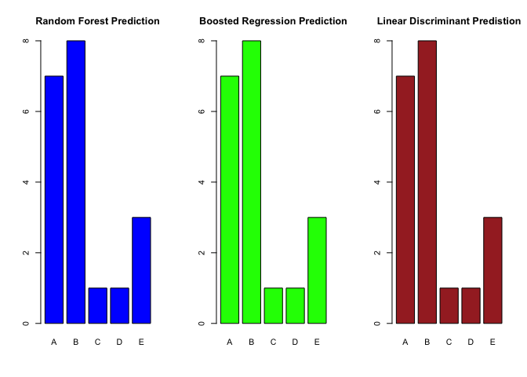

Machine Learning Assignment
================
Denis Levert on November 11, 2020

## Executive Summary

Stufffffff

## Exploratory Data

## Prediction

Important variables.

| Importance | Variable            | Overall |
| ---------: | :------------------ | ------: |
|          1 | roll\_belt          |   100.0 |
|          2 | pitch\_forearm      |    62.0 |
|          3 | yaw\_belt           |    56.9 |
|          4 | magnet\_dumbbell\_z |    43.9 |
|          5 | magnet\_dumbbell\_y |    43.3 |
|          6 | pitch\_belt         |    42.9 |
|          7 | roll\_forearm       |    41.6 |
|          8 | accel\_dumbbell\_y  |    23.8 |
|          9 | magnet\_dumbbell\_x |    19.0 |
|         10 | roll\_dumbbell      |    17.1 |

Plots.

<!-- -->

    ##       1   2   3   4   5   6   7   8   9   10 
    ## pdRF  "B" "A" "B" "A" "A" "E" "D" "B" "A" "A"
    ## pdGBM "B" "A" "B" "A" "A" "E" "D" "B" "A" "A"
    ## pdLDA "B" "A" "B" "A" "A" "E" "D" "B" "A" "A"

    ##       11  12  13  14  15  16  17  18  19  20 
    ## pdRF  "B" "C" "B" "A" "E" "E" "A" "B" "B" "B"
    ## pdGBM "B" "C" "B" "A" "E" "E" "A" "B" "B" "B"
    ## pdLDA "B" "C" "B" "A" "E" "E" "A" "B" "B" "B"

Accuracy.

    ## [1] "Random Forest Accuracy 99.3 %"

    ## [1] "Boosted Regression Accuracy 95.99 %"

    ## [1] "Linear Discriminant Accuracy 73.08 %"

Plot
